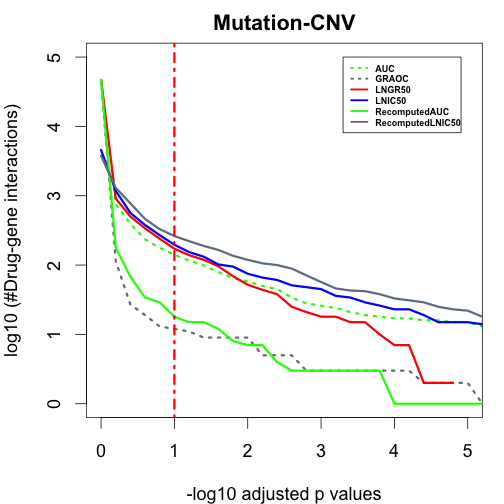
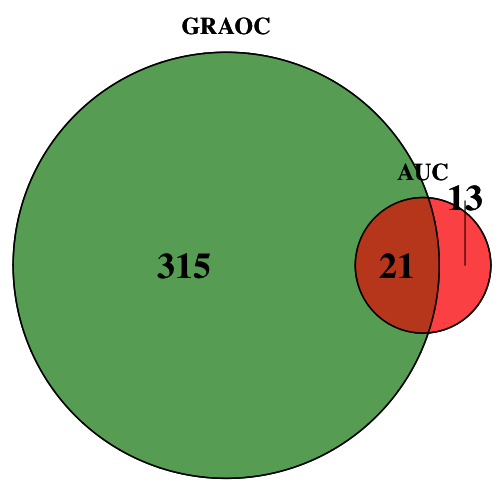
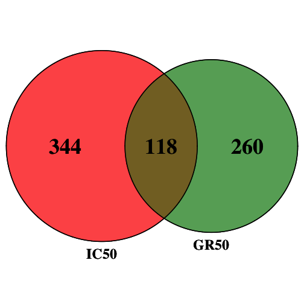
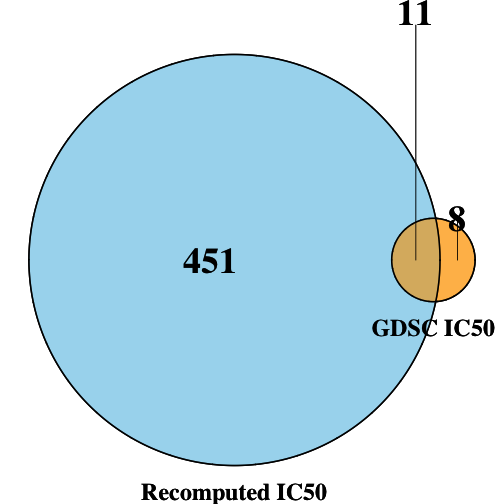
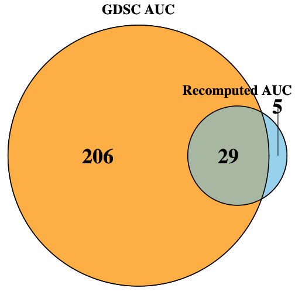
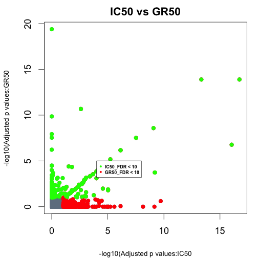
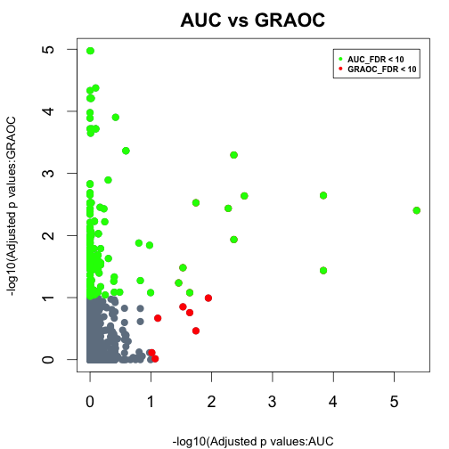
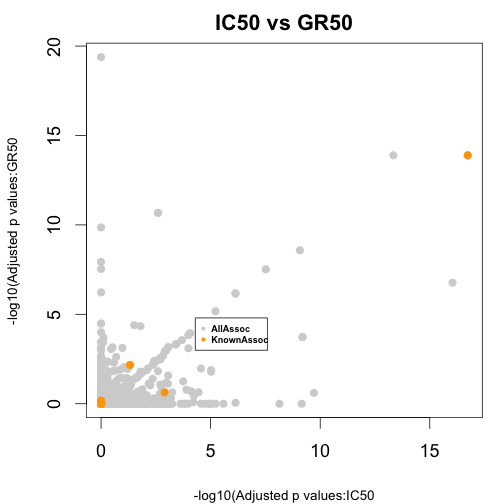
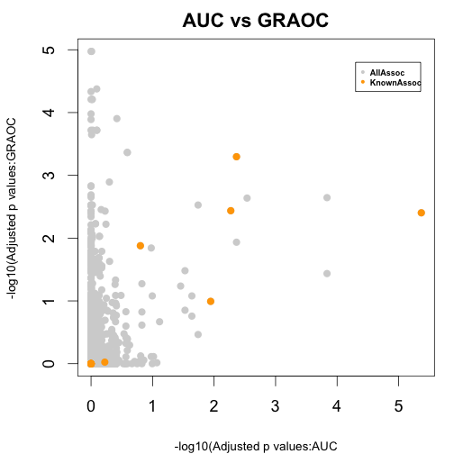

  

Generate ANOVA plots (Figure 2) in the report

The preprocessing steps used for the calculation of different metrics are documented in the GDSC vignette 
```vignette("GDSC_Calculate_AlternativeMetrics", package = "AlternativeDrugResponseMetrics")```.
 

The results of the preprocessing are stored in the csv files and are further processed by GDSCTools package in Python. For details regarding ANOVA, please check the python notebook ("GDSCTools_ANOVA.ipynb") and other files in the ANOVA folder

The results of the ANOVA analysis is loaded here and the ploting is documented below. 


Load data corresponding to different metrics and obtain the p-values. 

```r
library(AlternativeDrugResponseMetrics)
l <- grep("results_",data(package="AlternativeDrugResponseMetrics")$results[,"Item"],value = T)

pvalue_ranges<-seq(0,10,by=0.2)
Pvalues_allMetrics<-data.frame(pvalue_ranges)

allData = new.env()
data(list=l,envir = allData)


for(iMetric in ls(allData))
{
	#Extract the FDR from each of the ANOVA results file
	Allgenes_pvalues <- allData[[iMetric]]
	Allgenes_pvalues_corrected<-as.data.frame(sapply(Allgenes_pvalues$ANOVA_FEATURE_FDR, function(x) -log10(x/100)))
	p_adjusted_values_allgenes<-Allgenes_pvalues_corrected[,1]
	Allpvalues_allGenes<-c()
	
	for(j in 1:length(pvalue_ranges))
	{
		#Extract the number of drug gene associations for the different p value ranges
		Adjustedvalues_WithinRange_allGenes <- length( subset( p_adjusted_values_allgenes, p_adjusted_values_allgenes > pvalue_ranges[j] ))
		Allpvalues_allGenes <- c(Allpvalues_allGenes, log10(Adjustedvalues_WithinRange_allGenes))
	}
	Pvalues_allMetrics <- cbind.data.frame(Pvalues_allMetrics,as.data.frame(Allpvalues_allGenes))
}

headers_Pvalues_allMetrics<-gsub("results_","",ls(allData))
colnames(Pvalues_allMetrics)<-c("pvalue_ranges",headers_Pvalues_allMetrics)

head(Pvalues_allMetrics)
#>   pvalue_ranges      AUC    GRAOC   LNGR50   LNIC50 RecomputedAUC
#> 1           0.0 4.668852 4.669763 3.659155 4.668852      4.669763
#> 2           0.2 2.883661 2.959995 3.070776 2.056905      2.250420
#> 3           0.4 2.593286 2.699838 2.752048 1.431364      1.832509
#> 4           0.6 2.371068 2.528917 2.577492 1.278754      1.531479
#> 5           0.8 2.247973 2.380211 2.431364 1.113943      1.462398
#> 6           1.0 2.149219 2.235528 2.292256 1.079181      1.255273
#>   RecomputedLNIC50
#> 1         3.577377
#> 2         3.114277
#> 3         2.889302
#> 4         2.664642
#> 5         2.517196
#> 6         2.418301
```


```r
par(cex=1,mar=c(4,4,2,1),cex.lab=1,cex=1.5,font=2)

#Plot the p values against the number of drug-gene associations
plot(Pvalues_allMetrics$pvalue_ranges,Pvalues_allMetrics$AUC,xlab="-log10 adjusted p values",ylab="log10 (#Drug-gene interactions)",main="Mutation-CNV",col="green",pch=16,type="l",lty=3,lwd=3,cex.axis=1,xlim=c(0,5),ylim=c(0,5))
points(Pvalues_allMetrics$pvalue_ranges,Pvalues_allMetrics$LNIC50,col="slategrey",pch=16,type='l',lty=3,lwd=3,xlim=c(0,5),ylim=c(0,5))
points(Pvalues_allMetrics$pvalue_ranges,Pvalues_allMetrics$GRAOC,col="red",pch=16,type='l',lty=1,lwd=3,xlim=c(0,5),ylim=c(0,5))
points(Pvalues_allMetrics$pvalue_ranges,Pvalues_allMetrics$LNGR50,col="blue",pch=16,type='l',lty=1,lwd=3,xlim=c(0,5),ylim=c(0,5))
points(Pvalues_allMetrics$pvalue_ranges,Pvalues_allMetrics$RecomputedAUC,col="green",pch=16,type='l',lty=1,lwd=3,xlim=c(0,5),ylim=c(0,5))
points(Pvalues_allMetrics$pvalue_ranges,Pvalues_allMetrics$RecomputedLNIC50,col="slategrey",pch=16,type='l',lty=1,lwd=3,xlim=c(0,5),ylim=c(0,5))
abline (v=1,col="red",lty=4,lwd=3)
legend(3.3,5,c(headers_Pvalues_allMetrics[1],headers_Pvalues_allMetrics[2],headers_Pvalues_allMetrics[3],headers_Pvalues_allMetrics[4],headers_Pvalues_allMetrics[5],headers_Pvalues_allMetrics[6]),lty=c(3,3,1,1,1,1),lwd=c(2.5,2.5,2.5,2.5,2.5,2.5),cex=0.5,col=c("green","slategrey","red","blue","green","slategrey"))
```




Generate venn diagrams to check for the overlap in associations between different metrics (Figure 4 and Figure 14 in report)

Function to make venn diagrams

```r
library("VennDiagram")
#> Loading required package: grid
#> Loading required package: futile.logger
Associations_overlap<-function(Metric1,Metric2,Metric_type,Fig_FileName,col_comb)
{
  Metric1_FDR<- Metric1[Metric1$ANOVA_FEATURE_FDR<25,]
  Metric2_FDR<-Metric2[Metric2$ANOVA_FEATURE_FDR<25,]
  Metric1_Metric2_overlap<-merge(Metric1_FDR,Metric2_FDR,by=c("FEATURE","DRUG_NAME"))
  
  grid.newpage()
  #jpeg(Fig_FileName,quality=100)
  venn.plot<-draw.pairwise.venn(area1=nrow(Metric1_FDR),area2=nrow(Metric2_FDR), cross.area=nrow(Metric1_Metric2_overlap),category=Metric_type,fill=col_comb,cat.pos=c(180,180),fontfamily = rep("serif", 3),fontface=rep("bold",3),cat.fontfamily=rep("serif",2),cat.fontface=rep("bold",2),cex=rep(3,3),cat.cex=rep(2,2)) 
  grid.draw(venn.plot)
  #dev.off()
  }
```

Find the associations that overlap between AUC and GRAOC (Figure 4)

```r
Associations_overlap(results_RecomputedAUC,results_GRAOC,c("AUC","GRAOC"),"AUC_GRAOC.jpeg",c("red","forest green"))
```



Find the associations that overlap between IC50 and GR50 (Figure 4)

```r
Associations_overlap(results_RecomputedLNIC50,results_LNGR50,c("IC50","GR50"),"IC50_GR50.jpeg",c("red","forest green"))
```


Find the associations that overlap between GDSC IC50 and Recomputed IC50 (Figure 16)


```r
Associations_overlap(results_RecomputedLNIC50,results_LNIC50,c("Recomputed IC50","GDSC IC50"),"GDSC_RecomputedIC50.jpeg",c("skyblue","orange"))
```



Find the associations that overlap between GDSC AUC and Recomputed AUC (Figure 16)

```r
Associations_overlap(results_RecomputedAUC,results_AUC,c("Recomputed AUC","GDSC AUC"),"GDSC_RecomputedAUC.jpeg",c("skyblue","orange"))
```



Compare the FDRs of 2 different metrics to find out the associations that found in one but not the other; Only those associations with FDR < 10% are highlighted here (Figure 5, Top panel)

Function to plot the FDRs

```r
FDR_comp<-function(metric1,metric2,Fig_FileName,label1,label2,main_heading,legend_labels)
{
  #Merge the 2 metrics
  Diff_metrics_mergeFDRs<-merge(metric1, metric2, by=c("FEATURE","DRUG_NAME"))
  Metric1_Metric2_FDR_assoc<-cbind.data.frame(Assoc=paste(Diff_metrics_mergeFDRs$DRUG_NAME,Diff_metrics_mergeFDRs$FEATURE,sep="-"),Metric1_FDR=as.vector(-log10(Diff_metrics_mergeFDRs$ANOVA_FEATURE_FDR.x/100)),Metric2_FDR=as.vector(-log10(Diff_metrics_mergeFDRs$ANOVA_FEATURE_FDR.y/100)))
  
  #Pick only those associations with FDR < 10%
  Metric1_FDR_extract<- Metric1_Metric2_FDR_assoc[which(Metric1_Metric2_FDR_assoc$Metric1_FDR>1),]
  Metric2_FDR_extract<- Metric1_Metric2_FDR_assoc[which(Metric1_Metric2_FDR_assoc$Metric2_FDR>1),]
  
  #jpeg(filename=Fig_FileName,quality=100)
  par(cex=1,mar=c(4,4,2,1),cex.lab=0.75,cex=1.5,font=2)
  plot(Metric1_Metric2_FDR_assoc$Metric1_FDR,Metric1_Metric2_FDR_assoc$Metric2_FDR,xlab=label1,ylab=label2,main=main_heading,col="slate gray",pch=16,cex.axis=1)
  
  #Highlight those associations that are significant and found in one metric, but not the other 
  points(Metric1_FDR_extract$Metric1_FDR,Metric1_FDR_extract$Metric2_FDR,col="red",pch=16)
  points(Metric2_FDR_extract$Metric1_FDR,Metric2_FDR_extract$Metric2_FDR,col="green",pch=16)
  #legend(13,20,legend_labels,pch=16,cex=0.5,col=c("green","red"))
  legend(4,5,legend_labels,pch=16,cex=0.5,col=c("green","red"))
  #dev.off()
}
```

Plot the FDRs of IC50s and GR50s

```r
IC50_GR50_FDR <- FDR_comp(results_RecomputedLNIC50,results_LNGR50,"IC50_GR50_FDRcomp.jpeg","-log10(Adjusted p values:IC50","-log10(Adjusted p values:GR50","IC50 vs GR50",c("IC50_FDR < 10","GR50_FDR < 10"))
```



Plot the FDRs of AUCs and GRAOCs

```r
AUC_GRAOC_FDR <- FDR_comp(results_RecomputedAUC,results_GRAOC,"AUC_GRAOC_FDRcomp.jpeg","-log10(Adjusted p values:AUC","-log10(Adjusted p values:GRAOC","AUC vs GRAOC",c("AUC_FDR < 10","GRAOC_FDR < 10"))
```



Compare the FDRs of 2 different metrics to find out the distribution of known associations (highlighted in orange); Figure 5, Bottom panel

Function to plot the FDRs and highlight known associations


```r
data(GDSC_KnownAssociations)
FDR_KnownAssoc<-function(metric1,metric2,Fig_FileName,label1,label2,main_heading,legend_labels)
{
  Metric1_Metric2_FDR_merged<-merge(metric1, metric2, by=c("DRUG_NAME","FEATURE"))
  Metric1_Metric2_FDR_merged_DrugFeature<-cbind.data.frame(Metric1_Metric2_FDR_merged,Ident_Drug_Feature=paste(as.vector(Metric1_Metric2_FDR_merged$DRUG_NAME),as.vector(Metric1_Metric2_FDR_merged$FEATURE),sep="-"))
 Metric1_Metric2_FDR_merged_assoc_extract<-Metric1_Metric2_FDR_merged_DrugFeature[grepl(paste(as.vector(GDSC_KnownAssociations$Ident_Drug_Feature),collapse="|"),as.vector(Metric1_Metric2_FDR_merged_DrugFeature$Ident_Drug_Feature)),]

  Metric1_Metric2_FDR_assoc<-cbind.data.frame(Assoc=paste(Metric1_Metric2_FDR_merged$DRUG_NAME,Metric1_Metric2_FDR_merged$FEATURE,sep="-"),Metric1_FDR=as.vector(-log10(Metric1_Metric2_FDR_merged$ANOVA_FEATURE_FDR.x/100)),Metric2_FDR=as.vector(-log10(Metric1_Metric2_FDR_merged$ANOVA_FEATURE_FDR.y/100)))
Metric1_FDR_extract<-Metric1_Metric2_FDR_assoc[which(Metric1_Metric2_FDR_assoc$Metric1_FDR>1),]
Metric2_FDR_extract<-Metric1_Metric2_FDR_assoc[which(Metric1_Metric2_FDR_assoc$Metric2_FDR>1),]

#jpeg(filename=Fig_FileName,quality=100)
par(cex=1,mar=c(4,4,2,1),cex.lab=0.75,cex=1.5,font=2)
plot(Metric1_Metric2_FDR_assoc$Metric1_FDR,Metric1_Metric2_FDR_assoc$Metric2_FDR,xlab=label1,ylab=label2, main= main_heading,col="light gray",pch=16,cex.axis=1)
points(as.vector(-log10(Metric1_Metric2_FDR_merged_assoc_extract$ANOVA_FEATURE_FDR.x/100)),as.vector(-log10(Metric1_Metric2_FDR_merged_assoc_extract$ANOVA_FEATURE_FDR.y/100)),col="orange",pch=16)
legend(4.3,4.8,legend_labels,pch=16,cex=0.5,col=c("light gray","orange"))
#legend(14,19,legend_labels,pch=16,cex=0.5,col=c("light gray","orange"))
#dev.off()
}
```

Plot the FDRs of IC50s and GR50s with known associations

```r
IC50_GR50_FDR_KnownAssoc <- FDR_KnownAssoc(results_RecomputedLNIC50,results_LNGR50,"IC50_GR50_FDRcomp_KnownAssoc.jpeg","-log10(Adjusted p values:IC50","-log10(Adjusted p values:GR50","IC50 vs GR50",c("AllAssoc","KnownAssoc"))
```



Plot the FDRs of AUCs and GRAOCs with known associations

```r
AUC_GRAOC_FDR_KnownAssoc <- FDR_KnownAssoc(results_RecomputedAUC,results_GRAOC,"AUC_GRAOC_FDRcomp_KnownAssoc.jpeg","-log10(Adjusted p values:AUC","-log10(Adjusted p values:GRAOC","AUC vs GRAOC",c("AllAssoc","KnownAssoc"))
```




Compute distance to drug targets to find out how relevant are the drug gene interactions identified through ANOVA analysis of different drug response metrics

```r
library("igraph")
data(OmniPathNW)
data(Orig_Target)

IC50_Dist<-Distances_DrugTargets(results_RecomputedLNIC50,write.File=T,"IC50_DistanceToTargets.txt")
GR50_Dist<-Distances_DrugTargets(results_LNGR50,write.File=T,"GR50_DistanceToTargets.txt")
AUC_Dist<-Distances_DrugTargets(results_RecomputedAUC,write.File=T,"AUC_DistanceToTargets.txt")
GRAOC_Dist<-Distances_DrugTargets(results_GRAOC,write.File=T,"GRAOC_DistanceToTargets.txt")
```


Generate histograms to show the distribution of distances to drug targets


